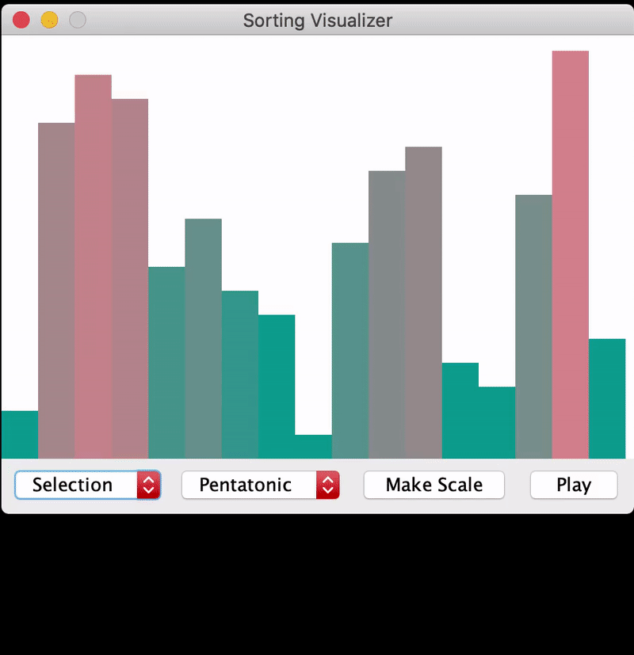

# The sound of sorting:
This project is a *visualizer* and *audibilizer* for sorting algorithms using Java. We choose to work with Merge Sort, Quick Sort, Bubble Sort, and Insertion Sort.However, the new sorting algorithms can be added with ease since by adding its implementation to **Sort.java**. 

To run the program, user choose a sorting algorithm (out of 4), audio scale (Pentatonic or Chromatic), and problem size (big or small).

# Demo

# How to run?
The **main()** function is in src/grinnell/edu/sortingvisualizer/GUI/SortingVisualizer.java. We also provide runable jar file and Mac OS X application bundle.

# Contributors: 
Matthew Palmeri: palmerim@grinnell.edu
Hannah Cha: chahannah@grinnell.edu
Quang Nguyen: nguyenqu2@grinnell.edu

citation: 

https://docs.oracle.com/javase/8/docs/api/java/util/function/Consumer.html

https://docs.oracle.com/javase/8/docs/api/java/util/function/Function.html

